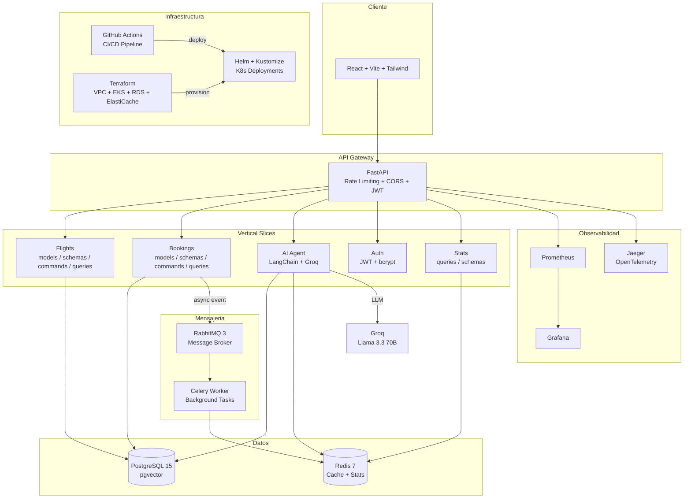

# ✈️ Flight Reservation System

[](https://github.com/jdabid/flight-reservation-system/actions/workflows/ci.yml)
[](https://github.com/jdabid/flight-reservation-system/actions/workflows/deploy.yml)


-4169E1?logo=postgresql&logoColor=white)


---

## 📋 Descripcion

Sistema fullstack de reservas de vuelos construido con **arquitectura de microservicios**, procesamiento asincrono de eventos y un **agente de IA con patron RAG**. El proyecto abarca desde el backend (FastAPI + PostgreSQL) y frontend (React + Tailwind) hasta la infraestructura completa en la nube (Terraform + EKS) con observabilidad integrada (Prometheus, Grafana, Jaeger).

---

## 🏗️ Arquitectura

El sistema sigue los patrones **Vertical Slice Architecture + CQRS**, donde cada feature es un modulo autocontenido con sus propios modelos, schemas, commands (escritura) y queries (lectura).



### Patrones Implementados

| Patron | Descripcion |
|--------|-------------|
| **Vertical Slice Architecture** | Cada feature es autocontenido con models, schemas, commands, queries |
| **CQRS** | Separacion de operaciones de lectura (queries) y escritura (commands) |
| **Event-Driven** | Eventos asincronos via RabbitMQ + Celery para estadisticas |
| **RAG** | Retrieval-Augmented Generation para el agente de IA |

---

## 🛠️ Tech Stack

| Categoria | Tecnologias |
|-----------|-------------|
| **Backend** | Python 3.11, FastAPI, Pydantic v2, SQLAlchemy 2.0, Alembic |
| **Frontend** | React 18, Vite, Tailwind CSS, TypeScript, Zustand |
| **Base de Datos** | PostgreSQL 15 (pgvector), Redis 7 |
| **Mensajeria** | RabbitMQ 3, Celery 5, Flower |
| **IA / ML** | LangChain, Groq (Llama 3.3 70B), pgvector (embeddings) |
| **Infraestructura** | Docker (multi-stage), Kubernetes, Helm, Kustomize |
| **Cloud (IaC)** | Terraform (AWS: VPC, EKS, RDS, ElastiCache, IAM) |
| **Observabilidad** | Prometheus, Grafana, Jaeger, OpenTelemetry |
| **CI/CD** | GitHub Actions, ghcr.io (Container Registry) |
| **Seguridad** | JWT (bcrypt), Rate Limiting, Non-root containers, CORS |

---

## 🚀 Quick Start

### Prerequisitos

- Docker y Docker Compose v2+
- Git
- `GROQ_API_KEY` (gratis en [console.groq.com](https://console.groq.com)) — solo para endpoints `/ai/*`

```bash
docker --version          # Docker 20+ requerido
docker compose version    # Compose v2+ requerido
```

### Instalacion

```bash
# 1. Clonar el repositorio
git clone https://github.com/jdabid/flight-reservation-system.git
cd flight-reservation-system

# 2. Configurar variables de entorno
echo "GROQ_API_KEY=gsk-tu-clave-aqui" > .env
```

### Ejecutar con Docker

```bash
# Levantar todos los servicios (10 contenedores)
docker compose up --build -d

# Verificar que todos estan saludables
docker compose ps

# Ver logs de la API
docker compose logs -f api
```

Una vez levantado, la API responde en `http://localhost:8000/health`:

```json
{"status": "ok", "message": "Sistema con Agente de IA Operativo"}
```

### Servicios Disponibles

| Servicio | Puerto | URL |
|----------|--------|-----|
| API (FastAPI) | 8000 | http://localhost:8000/docs |
| Frontend (React) | 3000 | http://localhost:3000 |
| RabbitMQ Management | 15672 | http://localhost:15672 |
| Flower (Celery) | 5555 | http://localhost:5555 |
| Grafana | 3001 | http://localhost:3001 |
| Prometheus | 9090 | http://localhost:9090 |
| Jaeger UI | 16686 | http://localhost:16686 |
| PostgreSQL | 5432 | — |
| Redis | 6379 | — |
| RabbitMQ (AMQP) | 5672 | — |

---

## 📡 Endpoints Principales

| Metodo | Ruta | Descripcion |
|--------|------|-------------|
| `GET` | `/health` | Health check del sistema |
| **Vuelos** | | |
| `POST` | `/api/v1/flights/destinations/` | Crear destino |
| `GET` | `/api/v1/flights/destinations/` | Listar destinos |
| `POST` | `/api/v1/flights/` | Crear vuelo |
| `GET` | `/api/v1/flights/` | Listar vuelos |
| **Reservas** | | |
| `POST` | `/api/v1/bookings/` | Crear reserva (calculo automatico de precio) |
| `GET` | `/api/v1/bookings/` | Listar reservas |
| **Autenticacion** | | |
| `POST` | `/api/v1/auth/register` | Registro de usuario |
| `POST` | `/api/v1/auth/login` | Login (retorna JWT) |
| `GET` | `/api/v1/auth/me` | Perfil del usuario autenticado |
| **Agente IA** | | |
| `POST` | `/api/v1/ai/chat` | Chat con agente IA (RAG) |
| `POST` | `/api/v1/ai/suggest-price` | Sugerencia de precios basada en demanda |
| **Estadisticas** | | |
| `GET` | `/api/v1/stats/general` | Recaudo total, mascotas, infantes |
| `GET` | `/api/v1/stats/destinations` | Destinos por popularidad |
| `GET` | `/api/v1/stats/destinations/{name}/taxes` | Impuestos por destino |
| `GET` | `/api/v1/stats/candy` | Logs de dulces a infantes |
| `GET` | `/api/v1/stats/notifications` | Notificaciones enviadas |

Documentacion interactiva (Swagger): [http://localhost:8000/docs](http://localhost:8000/docs)

---

## 🤖 Agente de IA

El sistema implementa un agente de IA con **patron RAG (Retrieval-Augmented Generation)** que combina datos reales del sistema con el LLM Llama 3.3 70B via Groq.

**Capacidades:**

- **Chat contextualizado**: responde preguntas sobre vuelos, precios, impuestos y politicas de mascotas usando datos reales de PostgreSQL
- **Analisis de demanda**: consulta estadisticas en tiempo real desde Redis (popularidad de destinos, ingresos, infantes)
- **Sugerencia de precios**: recomienda precios basados en la demanda actual y datos historicos
- **Tool Calling**: usa `@tool` de LangChain para acceder a PostgreSQL y Redis como fuentes de datos
- **Embeddings**: soporte para busqueda semantica con pgvector

```
Usuario → API → [Retrieval: PG + Redis] → [Augment: datos + pregunta] → [Generate: Groq LLM] → Respuesta
```

---

## 📊 Observabilidad

El sistema cuenta con una stack de observabilidad completa:

| Herramienta | Puerto | Proposito |
|-------------|--------|-----------|
| **Grafana** | [localhost:3001](http://localhost:3001) | Dashboards de metricas (admin/admin123) |
| **Prometheus** | [localhost:9090](http://localhost:9090) | Recoleccion de metricas |
| **Jaeger** | [localhost:16686](http://localhost:16686) | Distributed tracing (OpenTelemetry) |
| **Flower** | [localhost:5555](http://localhost:5555) | Monitor de tareas Celery |

Ademas incluye:
- **Logging estructurado** en formato JSON con correlation IDs
- **Metricas custom** de Prometheus (requests, latencia, errores)
- **Tracing distribuido** con OpenTelemetry exportando a Jaeger

---

## 🧪 Testing

```bash
# Tests de integracion (dentro de Docker)
docker compose exec api pytest tests/ -v --tb=short

# Tests unitarios
docker compose exec api pytest tests/unit/ -v --tb=short

# Con cobertura
docker compose exec api pytest tests/ -v --cov=src --cov-report=term-missing

# Reiniciar API despues de tests (recrea tablas)
docker compose restart api
```

### Tests Incluidos

| Suite | Tests |
|-------|-------|
| **Integracion** | Flujo completo de reserva, validacion mascotas, precios negativos, edad invalida |
| **Unitarios** | Auth (registro, login, JWT), Flights (commands, queries), Bookings (commands, queries), Schemas |

---

## ☸️ Kubernetes

El proyecto incluye dos estrategias de despliegue en Kubernetes:

### Helm Charts

```bash
# Instalar/actualizar
helm upgrade --install flight-system ./infra/helm/flight-app

# Verificar
kubectl get pods -n flight-system
```

Recursos desplegados: Deployment (API + Worker), Service (ClusterIP), HPA (2-10 replicas, CPU 70%), ConfigMap, Secret, Ingress, NetworkPolicy, ServiceAccount.

### Kustomize

```bash
# Desplegar en dev
kubectl apply -k infra/kustomize/overlays/dev

# Desplegar en produccion
kubectl apply -k infra/kustomize/overlays/prod
```

Overlays disponibles: `dev`, `staging`, `prod` — cada uno con configuracion especifica de recursos, replicas y variables.

---

## 🏗️ Infraestructura como Codigo

El directorio `infra/terraform/` contiene modulos de Terraform para provisionar la infraestructura en AWS:

| Modulo | Recursos |
|--------|----------|
| **VPC** | VPC, subnets publicas/privadas, NAT Gateway, Internet Gateway |
| **EKS** | Cluster EKS, node groups, OIDC provider |
| **RDS** | PostgreSQL 15, subnet group, security group |
| **ElastiCache** | Redis cluster, subnet group, security group |
| **IAM** | Roles y policies para EKS, nodos y service accounts |

```bash
cd infra/terraform
terraform init
terraform plan
terraform apply
```

---

## 📁 Estructura del Proyecto

```
flight-reservation-system/
├── backend/
│   ├── src/
│   │   ├── main.py                     # Entry point FastAPI
│   │   ├── api/v1/                     # Rutas: flights, bookings, ai, auth, stats
│   │   ├── features/
│   │   │   ├── flights/                # models, schemas, commands, queries
│   │   │   ├── bookings/              # models, schemas, commands, queries, events
│   │   │   ├── auth/                  # models, schemas, commands, jwt
│   │   │   ├── ai/                    # agent.py, tools.py
│   │   │   └── stats/                 # schemas, queries
│   │   ├── shared/                    # database, redis, metrics, tracing, middleware
│   │   └── worker/                    # celery_app.py, tasks.py
│   ├── tests/                         # Integracion + unitarios
│   ├── alembic/                       # Migraciones de base de datos
│   └── pyproject.toml                 # Configuracion: ruff, mypy, pytest, coverage
│
├── frontend/                          # React + Vite + Tailwind + TypeScript
│   ├── src/
│   │   ├── pages/                     # LoginPage, DashboardPage
│   │   ├── components/                # ProtectedRoute
│   │   ├── stores/                    # Zustand (authStore)
│   │   └── api/                       # Cliente HTTP
│   └── vite.config.ts
│
├── infra/
│   ├── docker/                        # Dockerfile (multi-stage), init-pgvector.sql
│   ├── helm/flight-app/               # Helm chart completo
│   ├── kustomize/                     # Base + overlays (dev, staging, prod)
│   ├── terraform/                     # AWS: VPC, EKS, RDS, ElastiCache, IAM
│   ├── prometheus/                    # prometheus.yml
│   └── grafana/                       # Dashboards + provisioning
│
├── .github/workflows/                 # CI (ci.yml) + Deploy (deploy.yml)
├── docker-compose.yml                 # 10 servicios orquestados
├── docker-compose.dev.yml             # Override para desarrollo
└── README.md
```

---

## 📄 Documentacion

| Documento | Ubicacion |
|-----------|-----------|
| Evaluacion tecnica | `evaluacion-tecnica/evaluacion-proyecto.md` |
| Plan de transformacion | `evaluacion-tecnica/cronograma-transformacion.md` |
| Cronograma Scrum | `evaluacion-tecnica/cronograma-scrum.md` |
| Registro de errores | `evaluacion-tecnica/errores/` |
| Propuesta arquitectonica | `propuesta-arquitectonica.md` |
| Preguntas tecnicas | `LEARNING/questions.md` |

---

## 👥 Autor

**jdabid** — [github.com/jdabid](https://github.com/jdabid)

---

## 📝 Licencia

Este proyecto esta bajo la licencia MIT. Ver el archivo [LICENSE](LICENSE) para mas detalles.
