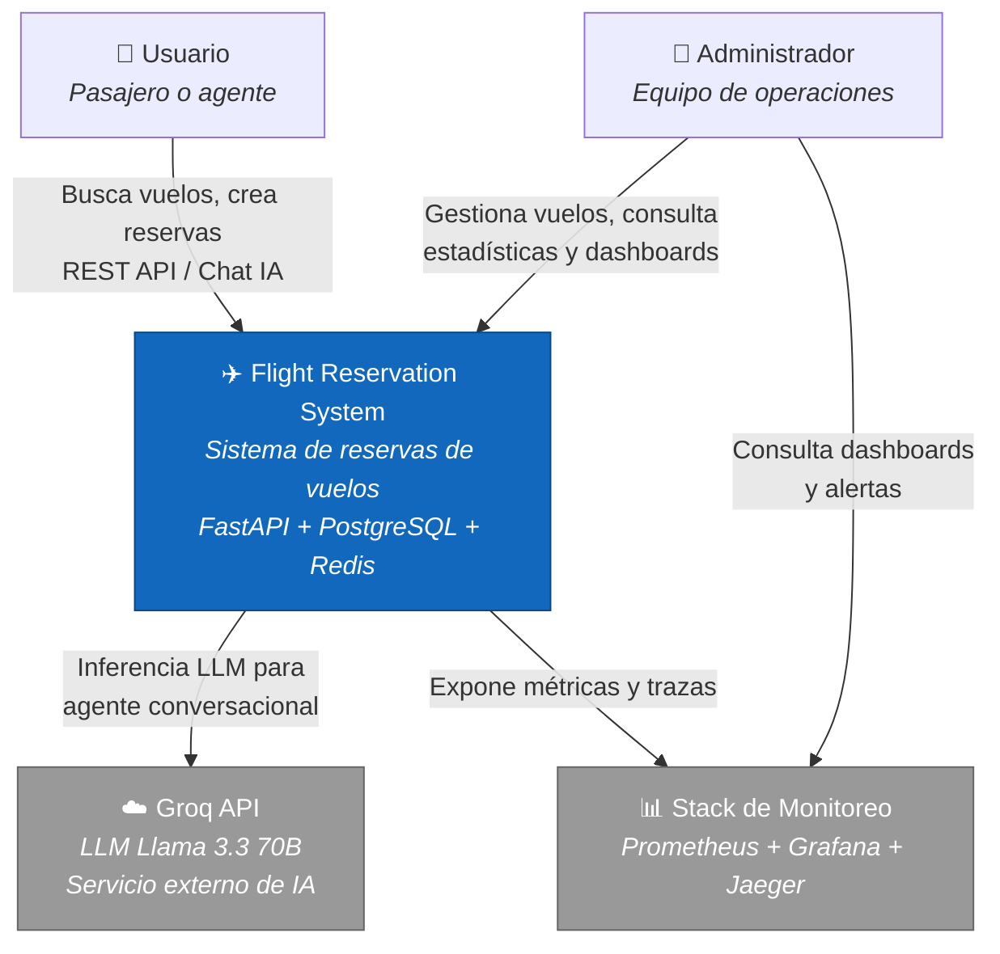
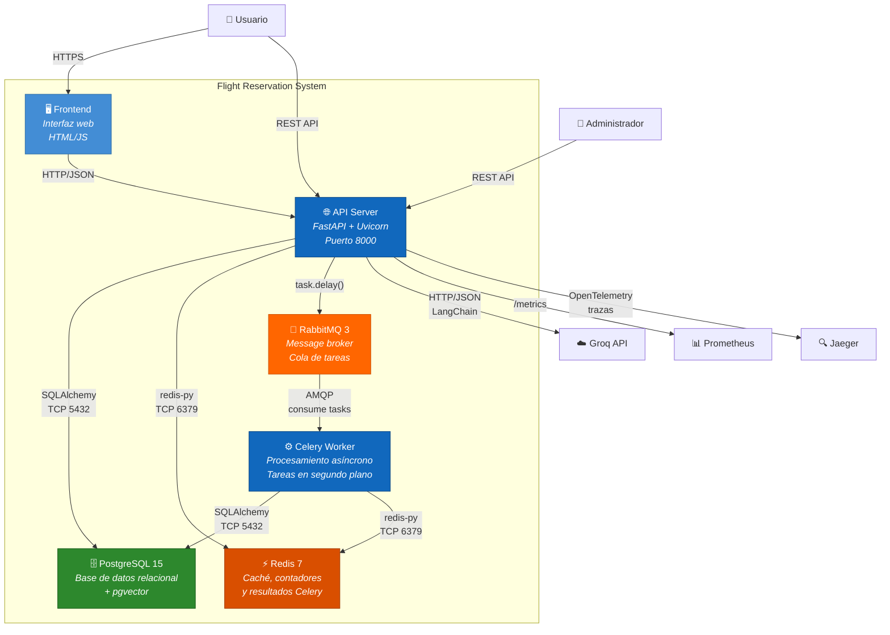
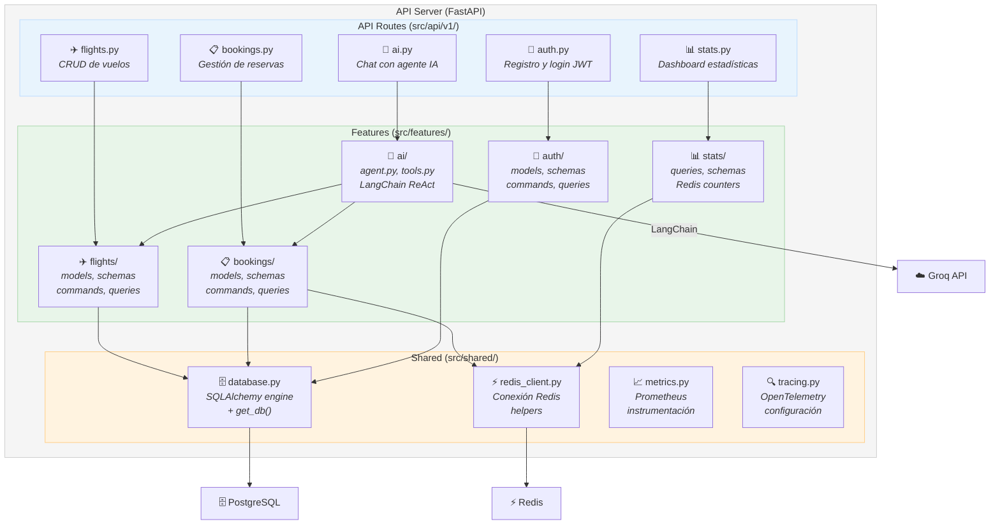

# Modelo C4 - Flight Reservation System

Diagramas arquitectónicos siguiendo el modelo C4 de Simon Brown.

---

## Nivel 1: Contexto del Sistema

Muestra el sistema de reservas y sus interacciones con usuarios y servicios externos.

---

## Nivel 2: Contenedores

Detalle de los contenedores que componen el sistema.

---

## Nivel 3: Componentes (API Server)

Detalle interno del contenedor API con sus features y módulos compartidos.

---

## Notas

- **Nivel 4 (Código)** no se incluye ya que el código fuente es la mejor documentación a ese nivel.
- Los diagramas se generan con [Mermaid](https://mermaid.js.org/) y se renderizan en GitHub/GitLab.
- Para visualizar localmente: usar extensión Mermaid de VS Code o [mermaid.live](https://mermaid.live).
